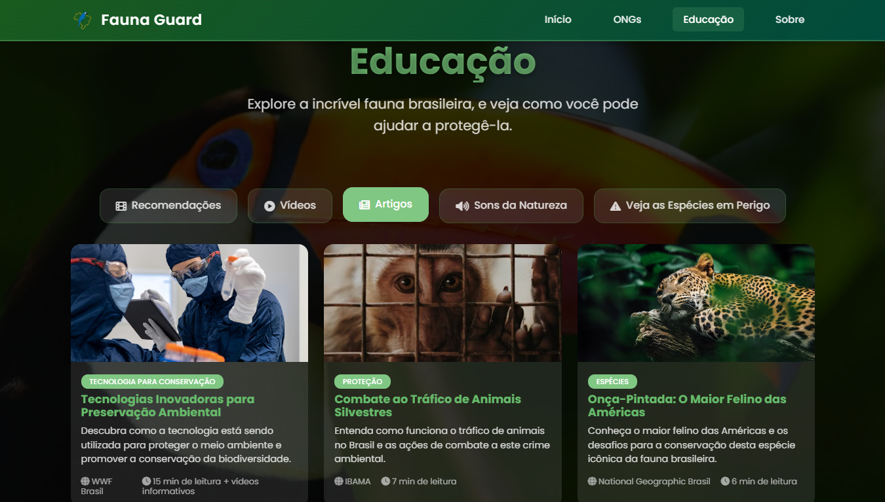

# Fauna Guard 🐾

Plataforma web dedicada à conscientização sobre a preservação da fauna brasileira, reunindo organizações, materiais educativos, recomendações, sons naturais e espécies ameaçadas – tudo em um só lugar para inspirar proteção e engajamento.

## 🚀 Visão Geral

O **Fauna Guard** nasceu da mesma motivação de aproximar tecnologia e conservação ambiental. Evoluiu de um projeto anterior voltado aos oceanos (Sacred Ocean) para focar totalmente em biodiversidade terrestre brasileira. O objetivo é facilitar o acesso rápido a ONGs, conteúdos educativos e ferramentas de sensibilização para quem deseja aprender e ajudar.

## 🌿 Funcionalidades Principais

- **Início:** Chamada direta para explorar ONGs, materiais educativos e conhecer o projeto.
- **ONGs:** Lista de organizações brasileiras e internacionais atuantes na conservação (onça-pintada, arara-azul, mico-leão-dourado, tamanduá-bandeira, lobo-guará, entre outras).
- **Educação:** Artigos, vídeos, documentários e filmes para compreender ameaças, biomas e comportamentos.
- **Sons da Natureza:** Áudios imersivos (floresta, cachoeira, chuva) para ambientação educativa.
- **Espécies Ameaçadas:** Grid rápido com links externos para detalhes e lista completa via ICMBio.
- **Sobre:** Autor, missão, habilidades e links de contato.

## 🛠 Tecnologias & Abordagem

- HTML5
- CSS3
- JavaScript

## 📚 Conteúdo Educacional

- Artigos sobre biodiversidade, tecnologia para conservação, tráfico de fauna e biomas brasileiros.
- Vídeos selecionados (biomas, comunicação animal, povos indígenas, aves endêmicas).
- Recomendações cinematográficas para sensibilização ambiental.

## 📱 Responsividade

Desenhado mobile-first com ajustes para tablets e desktops. Grids se reorganizam, componentes mantêm legibilidade em telas menores.

## 👤 Autor

**Henrique Baptista Bandeira**  
Desenvolvedor web focado em unir tecnologia e conservação ambiental.  
Portfólio: <https://spyhenry.github.io/>  

---

**Fauna Guard** 🐾 Conectando pessoas à preservação da fauna brasileira através da tecnologia.

Desenvolvido com dedicação por **Henrique Baptista Bandeira**
